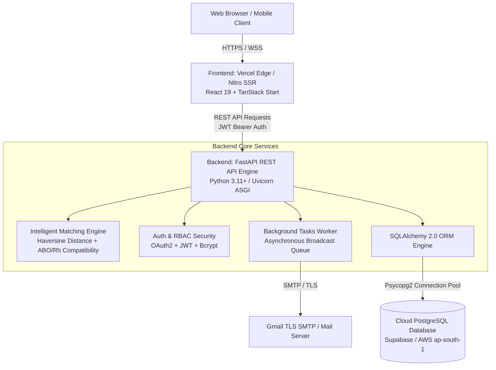

# Technical Stack & System Architecture Report
**Project Name:** LifeDrop — Smart Blood Donation Management System (SBDMS)  
**Academic / Defense Submission Documentation**  
**Document Version:** 1.0.0  
**Date:** September 2026  

---

## 1. Executive Summary & Architectural Overview

**LifeDrop (Smart Blood Donation Management System)** is engineered as a decoupled, high-performance, and privacy-first healthcare web application. The platform coordinates voluntary blood donors, patients/recipients, hospitals, and partner blood banks across Bangladesh with intelligent matching, real-time emergency 50km broadcasts, and donor privacy safeguards.

### High-Level System Architecture



---

## 2. Frontend Technology Stack

The frontend is built with modern web technologies, prioritizing server-side rendering (SSR), type safety, accessibility, and dynamic geospatial interfaces.

| Category | Technology / Library | Version | Role & Architectural Purpose |
| :--- | :--- | :--- | :--- |
| **Core Framework** | **React** | `19.2.0` | Latest concurrent React engine with modern hooks, server components, and optimized reconciliation. |
| **Language** | **TypeScript** | `5.8.3` | End-to-end static type safety, contract matching with backend Pydantic schemas, and error elimination. |
| **Build & Tooling** | **Vite** | `8.1.5` | Ultra-fast next-generation development server and production bundler. |
| **Server-Side Engine** | **Nitro / TanStack Start** | `1.168.32` / `3.0` | Server-Side Rendering (SSR), edge deployment compatibility on Vercel, and fast time-to-first-byte (TTFB). |
| **Routing** | **@tanstack/react-router** | `1.170.18` | Strictly type-safe, file-based routing system with search parameter validation, loaders, and SSR hydration boundaries. |
| **Server State Management** | **@tanstack/react-query** | `5.101.1` | Asynchronous data fetching, background synchronization, cache invalidation, and optimistic UI updates. |
| **Styling & Design System**| **Tailwind CSS v4** | `4.2.1` | Utility-first CSS engine with Vite plugin (`@tailwindcss/vite`), CSS custom properties, and theme tokens. |
| **UI Primitives** | **Radix UI Primitives** | Latest | Headless, accessible (WAI-ARIA compliant) components: Dialogs, Dropdowns, Tabs, Switch, Slider, Tooltip, etc. |
| **Form Management** | **React Hook Form** | `7.71.2` | High-performance, un-controlled form state management with minimal re-renders. |
| **Schema Validation** | **Zod** | `3.24.2` | Client-side runtime schema validation integrated directly into React Hook Form via `@hookform/resolvers`. |
| **Geospatial & Maps** | **Leaflet & React-Leaflet** | `1.9.4` / `5.0.0` | Interactive maps, OpenStreetMap tile rendering, hospital markers, donor proximity circles, and privacy jittering. |
| **Data Visualization** | **Recharts** | `2.15.4` | Composable SVG charts for blood inventory status, emergency analytics, and donation distribution. |
| **Icons & Notifications** | **Lucide React & Sonner** | `0.575` / `2.0.7` | Clean SVG icon set and stacked toast notifications. |
| **Date Manipulation** | **date-fns** | `4.1.0` | Modular, lightweight date parsing, donation interval cooldown formatting, and relative timestamps. |

---

## 3. Backend Technology Stack

The backend is built as a modular REST API adhering to clinical guardrails, strict privacy standards, and asynchronous notification broadcasts.

| Category | Technology / Library | Version | Role & Architectural Purpose |
| :--- | :--- | :--- | :--- |
| **Web Framework** | **FastAPI** | `0.115.0+` | High-performance Python ASGI framework based on Starlette and OpenAPI standards. |
| **ASGI Web Server** | **Uvicorn** | `0.34.0+` | Lightning-fast ASGI server implementation for asynchronous Python request handling. |
| **Data Validation** | **Pydantic v2** | `2.10.0+` | Rust-backed fast data serialization, automatic type parsing, and schema definition. |
| **Environment Config** | **pydantic-settings** | `2.7.0+` | Type-safe application configuration from `.env` files and environment variables. |
| **Database Engine** | **PostgreSQL** | `15+` | Enterprise-grade relational database running on managed cloud infrastructure (AWS ap-south-1). |
| **ORM & Database Toolkit**| **SQLAlchemy** | `2.0.36+` | Modern Declarative 2.0 ORM with connection pooling, relationships, and schema migrations. |
| **Database Driver** | **psycopg2-binary** | `2.9.10+` | Robust, battle-tested C-based PostgreSQL adapter for Python. |
| **Authentication & Tokens**| **PyJWT** | `2.10.1+` | JSON Web Token (JWT) generation, validation, refresh token rotation (HS256 algorithm). |
| **Password Security** | **Bcrypt** | `4.2.1+` | Industry-standard salted cryptographic hashing for user credentials. |
| **Email Service** | **Python smtplib + TLS** | Built-in | Gmail TLS SMTP dispatch engine with HTML responsive templates and safe offline mock fallback. |
| **HTTP Client (Testing)** | **HTTPX** | `0.28.1+` | Asynchronous HTTP client for integration and end-to-end API testing. |
| **Automated Testing** | **Pytest** | `8.3.4+` | Unit testing and API route test suite runner. |

---

## 4. Key Algorithmic & Security Implementations

### 1. Haversine Geospatial Matching Engine
The system calculates the exact great-circle distance between a patient's medical facility and prospective donors on a spherical Earth:
$$\Delta\sigma = 2 \arcsin\left(\sqrt{\sin^2\left(\frac{\Delta\phi}{2}\right) + \cos(\phi_1)\cos(\phi_2)\sin^2\left(\frac{\Delta\lambda}{2}\right)}\right)$$
$$d = R \cdot \Delta\sigma \quad (\text{where } R = 6371 \text{ km})$$
- Evaluates donor radius dynamically: **5 km**, **10 km**, **25 km**, and **50 km**.

### 2. Clinical Compatibility Matrix
Blood matching enforces strict ABO and Rhesus antigen compatibility across all blood components:
- **Whole Blood & RBCs:** Strict antigen rules ($O^-$ universal donor; $AB^+$ universal recipient).
- **Platelets & Plasma:** Component-specific inverse compatibility.

### 3. Urgency Scoring Multipliers
- **Normal Urgency:** $1.0\times$ base matching priority.
- **Urgent Need:** $1.2\times$ prioritized matching score.
- **Emergency Broadcast:** $1.5\times$ maximum priority scoring with an instantaneous 50km radius broadcast.

### 4. Patient Rate Limiting & Anti-Spam Guardrail
- Restricts recipients to **maximum 2 active requests per patient within any 24-hour rolling window** to prevent queue flooding and phantom requests.
- Returns HTTP 429 Too Many Requests with actionable instructions to cancel outdated requests before opening new searches.

### 5. Two-Tier Privacy Safeguard
- **Donor Anonymity:** Donor residential coordinates are jittered (~1km grid) and personal names are masked (e.g., *"Rahman K."*) on public discovery views.
- **Phone Privacy:** Contact information unlocks **only** when a donor explicitly accepts a match request or when a patient designates public broadcast status.

### 6. Role-Based Access Control (RBAC)
The API protects administrative and clinical workflows using four distinct roles:
1. `DONOR`: Blood volunteers with gamified donation records and badge achievements.
2. `RECIPIENT`: Patients and attendants requesting emergency or scheduled blood units.
3. `HOSPITAL_ADMIN`: Partner medical centers managing inventory reserves and critical ICU needs.
4. `SYSTEM_ADMIN`: Platform supervisors monitoring audit logs, users, and campaign notices.

---

## 5. Deployment & Cloud Infrastructure

```
┌────────────────────────────────────────────────────────┐
│                     Vercel Cloud                       │
│  ┌──────────────────────────┐ ┌─────────────────────┐  │
│  │ Frontend Application     │ │ Backend API Service │  │
│  │ https://roktodeojibon... │ │ https://ruby-heartb │  │
│  │ - React 19 SSR (Nitro)   │ │ - Python 3.11 ASGI  │  │
│  │ - Edge CDN Asset Cache   │ │ - Serverless Engine │  │
│  └─────────────┬────────────┘ └──────────┬──────────┘  │
└────────────────┼─────────────────────────┼─────────────┘
                 │                         │
                 ▼                         ▼
         ┌───────────────┐         ┌───────────────┐
         │ User Browser  │         │   Supabase    │
         │ Desktop/Mobile│         │ Cloud Postgres│
         └───────────────┘         │ AWS ap-south-1│
                                   └───────────────┘
```

- **Frontend Deployment:** Vercel Cloud Platform with Nitro SSR cloudflare-module preset.  
  **Live URL:** [https://roktodeojibonbachao.vercel.app](https://roktodeojibonbachao.vercel.app)
- **Backend Deployment:** Vercel Serverless Functions running Python ASGI.  
  **Live API URL:** [https://ruby-heartbeat-backend.vercel.app](https://ruby-heartbeat-backend.vercel.app)
- **Database Deployment:** Managed PostgreSQL on Supabase (AWS Asia Pacific Mumbai `ap-south-1`).
- **Version Control & CI/CD:** GitHub repositories with automated build triggers on branch pushes:
  - Frontend: `https://github.com/Redwan-Ahmed241/Ruby-HeartBit`
  - Backend: `https://github.com/Redwan-Ahmed241/ruby-heartbeat-backend`

---

## 6. Quick Defense Summary Bullet Points

If asked during your defense presentation to summarize the tech stack in 30 seconds:

> **"Our project uses a modern decoupled full-stack architecture:**
> 1. **Frontend:** React 19 and TypeScript with TanStack Start / React Router for Server-Side Rendering (SSR), Tailwind CSS v4 and Radix UI for accessible components, TanStack Query v5 for caching, and Leaflet for interactive geospatial maps.
> 2. **Backend:** FastAPI with Python 3.11 and Pydantic v2 for high-speed, strictly-typed REST APIs, running on a Uvicorn ASGI server.
> 3. **Database & ORM:** Cloud PostgreSQL hosted on Supabase (AWS ap-south-1) managed through SQLAlchemy 2.0 with connection pooling.
> 4. **Algorithms & Security:** Custom Haversine geospatial proximity engine, ABO/Rh clinical compatibility matrix, OAuth2 with JWT (HS256) & Bcrypt hashing, RBAC across 4 roles, and dual-layer privacy masking for donor/patient contact numbers."
